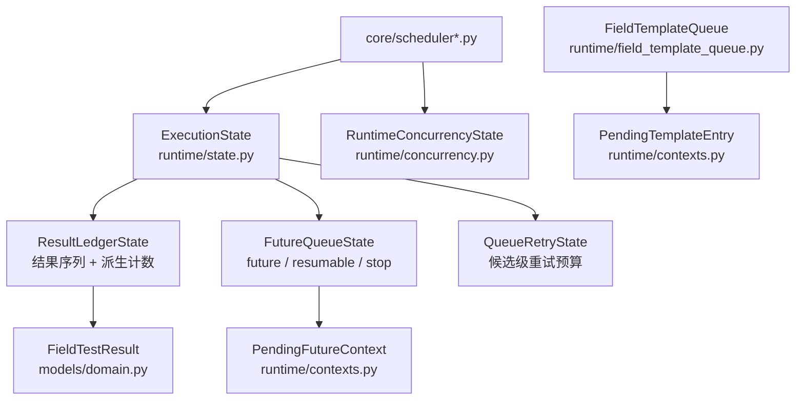

# 聚合边界图（State Ownership）

> 回答"这段可变状态归谁管、谁可以读写、重启后如何恢复"。
> 与 [AGENTS.md](../AGENTS.md) 的状态边界规则互为印证；本页只做聚合级地图，不重复实现细节。
> 领域术语对照见 [Code Map 术语表](code_map.md#7-术语表ubiquitous-language)。

## 1. 状态聚合总览

| 聚合 | 模块 | 职责 | 不变量 |
| --- | --- | --- | --- |
| `ExecutionState` | `runtime/state.py` | 运行期共享可变状态的唯一入口（facade） | 不新增影子字段；瞬时队列状态经 `reset_transient_queue_state()` 重置 |
| `ResultLedgerState` | `runtime/result_ledger.py` | **唯一权威结果序列** | 计数一律由 `metrics` 从 `results` 派生，不在别处维护影子计数 |
| `FutureQueueState` | `runtime/future_queue.py` | future 队列 + 可恢复远端 simulation + stop signal | 只经 `ExecutionState.future_queue` 访问 |
| `QueueRetryState` | `runtime/queue_retry.py` | 候选级 queue-busy 重试预算 | 重试预算只作用于候选键；不因单模板拥塞跳过整个字段 |
| `RuntimeConcurrencyState` | `runtime/concurrency.py` | worker 上限 + 拥塞冷却 | 由 `alpha.runtime.concurrency` 拥有，不并入 `ExecutionState` 字段 |
| `FieldTemplateQueue` | `runtime/field_template_queue.py` | 单字段在调度轮次间的模板队列（瞬时） | 每字段一个，轮次间缓存，字段完成即弃 |

## 2. 聚合关系图

## 3. 访问规则

- 结果计数从 `ExecutionState.result_ledger.metrics` 派生；不要在 `ExecutionState` 上新增
  `results` / 计数影子字段。
- future 队列、可恢复 simulation、stop signal 一律经 `ExecutionState.future_queue`；
  禁止在 `ExecutionState` 上新增 `pending_futures` / `resumable_simulations` /
  `stop_signal` 影子字段。
- worker 上限与拥塞冷却从 `alpha.runtime.concurrency` 导入，不并入 `ExecutionState`。
- queue-busy 重试只作用于候选键，由 `QueueRetryState` 统一管理；不要重新引入字段级
  拥塞计数或跳过集合。
- scheduler 代码不应再用裸 dict/set 重复实现重试预算更新规则。

## 4. 生命周期

- **checkpoint 恢复**：通过 `ExecutionState.reset_transient_queue_state()` 重置瞬时队列
  状态（`QueueRetryState.reset()`），不要直接逐个赋值内部集合。
- **结果序列**：`ResultLedgerState.results` 是权威结果，跨进程恢复时从 journal 重建，
  不随瞬时状态一起清空。
- **FieldTemplateQueue**：进程内瞬时对象，重启后由 planner 重新构建，不持久化。

## 5. 与 AGENTS.md 规则对照

| AGENTS.md 规则 | 落点 |
| --- | --- |
| `ExecutionState` 共享可变状态，先考虑专用 dataclass | 本页 1 的每个聚合 |
| queue retry 属于 `QueueRetryState` | `runtime/queue_retry.py` |
| future / resumable / stop 属于 `FutureQueueState` | `runtime/future_queue.py`，经 `ExecutionState.future_queue` |
| worker 上限与拥塞冷却属于 `RuntimeConcurrencyState` | `runtime/concurrency.py` |
| `ResultLedgerState.results` 唯一权威 | `runtime/result_ledger.py` |
| checkpoint 恢复重置瞬时队列 | `ExecutionState.reset_transient_queue_state()` |
